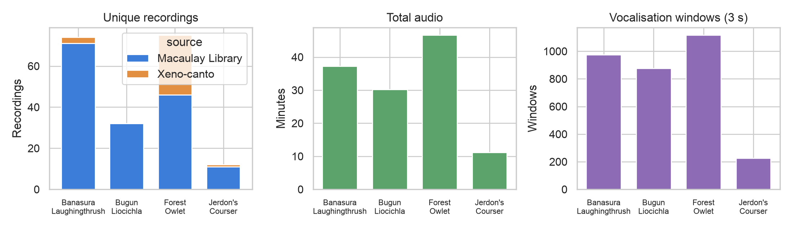
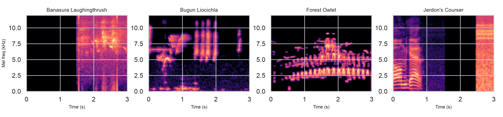
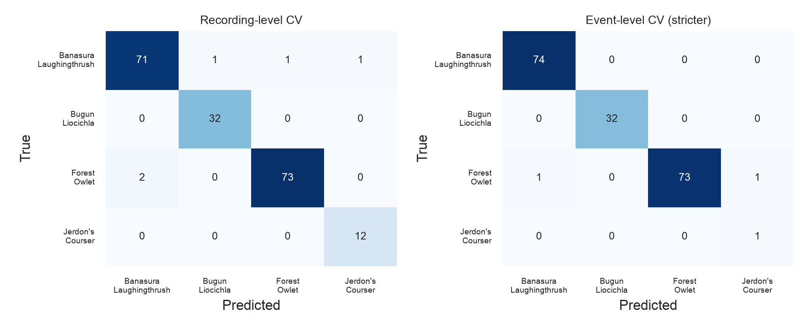
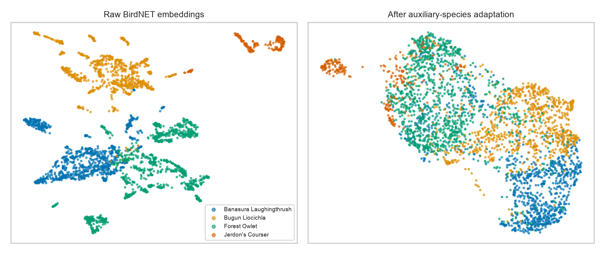
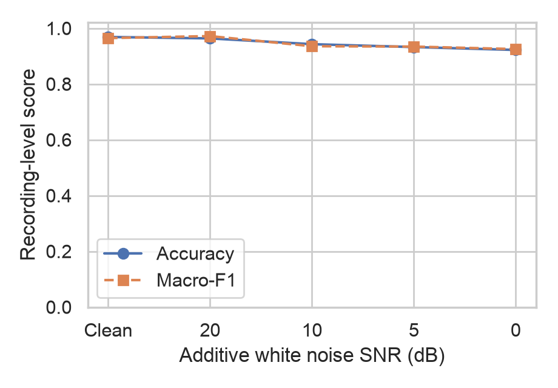
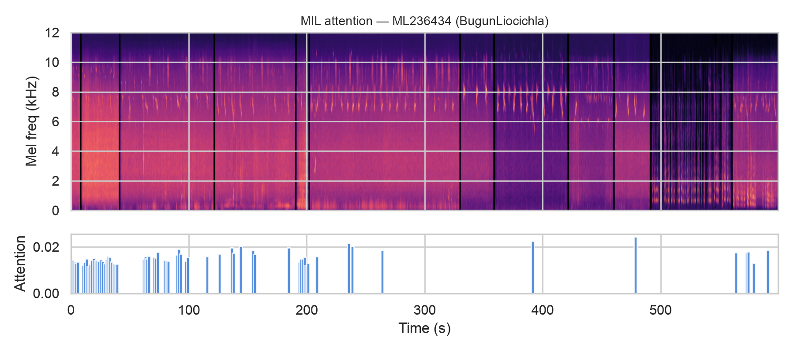

# Acoustic identification of India's Endangered and Critically Endangered endemic birds using bioacoustic foundation model embeddings

**Srivatsav Kannan¹, Valliappan Raman¹, Shanmugapriya K.R.¹**

¹ Department of Artificial Intelligence and Data Science, Coimbatore Institute of Technology, Coimbatore, India

## Summary

Automated acoustic monitoring is one of the few practical ways to survey rare and cryptic birds, but it depends on software that can recognise the target species, and the global classifiers that power most such monitoring do not cover the species that need it most. Four bird species endemic to India and listed as Endangered or Critically Endangered have sound recordings in public archives, the Forest Owlet, the Banasura Laughingthrush, the Bugun Liocichla, and Jerdon's Courser, yet only the Forest Owlet is recognised by BirdNET, the most widely used bird sound classifier. We gathered every public recording of these four species from the Macaulay Library and Xeno-canto, 193 unique recordings totalling approximately 125 minutes, and tested whether this material is sufficient to train reliable classifiers. Classifiers were trained on acoustic embeddings extracted with BirdNET and were evaluated on a held-out set of recordings that had played no part in training or model tuning. The best classifier identified the correct species for 97.4% of recordings (95% confidence interval 94.8 to 99.5), and its accuracy fell only to 92.2% when the test audio was degraded with synthetic noise as loud as the original recording itself. Because a classifier deployed in the field must also ignore the many species it was never trained on, we further tested the system against 1,891 recordings of 28 other Indian endemic species. By adding a rejection category trained on recordings of other species to the model, we reduce the false positive rate to just 13.4% while still identifying 89.1% of target recordings correctly. As a result, we conclude that reliable classifiers can be developed using publicly available data to aid in the monitoring of endangered birds.

**Keywords:** *Athene blewitti*, *Montecincla jerdoni*, *Liocichla bugunorum*, *Rhinoptilus bitorquatus*, passive acoustic monitoring, transfer learning, open-set recognition

## Introduction

India is home to over 1,300 bird species, of which more than 75 are considered endemic, occurring nowhere else in the world (SoIB 2023). Endemic species with narrow geographic ranges are disproportionately vulnerable to habitat loss, and several Indian endemics are now assessed as Endangered or Critically Endangered on the IUCN Red List (IUCN 2025). While rarely spotted in the wild, four such species have sound recordings available in the major public archives: Forest Owlet (*Athene blewitti*), Banasura Laughingthrush (*Montecincla jerdoni*), Bugun Liocichla (*Liocichla bugunorum*), and Jerdon's Courser (*Rhinoptilus bitorquatus*).

These four species are natural candidates for passive acoustic monitoring. They are nocturnal or skulking, occupy terrain where visual survey is difficult, and have distinctive vocalisations. Acoustic monitoring at useful scales, however, requires automated identification, because continuous recorders produce far more audio than observers can review. The classifiers that currently dominate applied bioacoustics cannot provide this identification for these species. We verified that only the Forest Owlet is present in the label set of BirdNET V2.4 (Kahl et al. 2021), the most widely used bird song classification system, and the other three species therefore cannot be detected by it at any confidence threshold. Therefore, there exists a need for classifiers specifically trained to classify these four species.

However, training classifiers for endangered species with a limited number of recordings presents multiple methodological difficulties. The complete public record of these four species ranges from just 12 to 75 recordings per species. Datasets this small cannot support training conventional deep networks, so we instead build on acoustic embeddings from a large pretrained bird sound model, which transfer to small datasets far more effectively (Ghani et al. 2023).

The study comprises four analyses. First, we compare three classifier families on the four-species identification task, a fine-tuned convolutional network on spectrograms representing standard practice, a lightweight classifier on frozen BirdNET embeddings, and a multiple instance learning model with attention that classifies whole recordings. We evaluate every model under two cross-validation schemes, one splitting at the level of the unique recording and a stricter one splitting at the level of the recording session. Then, we test whether retraining the embeddings on 28 other endemic Indian species makes the four target species easier to distinguish. We also evaluate whether the classifier can identify and reject species not included in our study, by evaluating it against 1,891 recordings of the 28 non-target endemics and adding an explicit background class as a remedy. Finally, we measure robustness by degrading test audio with additive noise at controlled signal-to-noise ratios. These analyses effectively build and evaluate bird sound classifiers using publicly available data, acting as a critical step towards full automated acoustic monitoring.

## Methods

### Data sources

We filtered the IUCN Red List for bird species endemic to India and listed as Endangered or Critically Endangered. Seven species qualified, of which the Great Nicobar Serpent Eagle (*Spilornis klossi*), the Himalayan Quail (*Ophrysia superciliosa*), and the Manipur Bush Quail (*Perdicula manipurensis*) had no usable recordings. The remaining four species listed in Table 1 form the study set.

All available recordings of the four species were obtained from the Macaulay Library and Xeno-canto.

**Table 1.** The assembled dataset. Recording counts are unique recordings after duplicate removal, and windows refer to the numbers of three-second vocalisation segments.

| Species | Macaulay Library | Xeno-canto | Total recordings | Total audio (min) | Windows |
|---|---|---|---|---|---|
| Forest Owlet | 46 | 29 | 75 | 46.6 | 1,116 |
| Banasura Laughingthrush | 71 | 3 | 74 | 37.3 | 976 |
| Bugun Liocichla | 32 | 0 | 32 | 30.3 | 877 |
| Jerdon's Courser | 11 | 1 | 12 | 11.1 | 226 |

### Data processing

Every file was assigned its archive catalogue identifier, and its provenance (species, source archive, Xeno-canto quality grade, duration, and sample rate) was recorded in a manifest. After deduplication using both archive identifiers and SHA-256 hashes of the recordings, the dataset contained 193 unique recordings totalling approximately 125 minutes (Figure 1).

Each recording was decoded to mono 48 kHz audio and segmented into windows of three seconds with 50% overlap, matching the native analysis window commonly used by classifier systems like BirdNET (Kahl et al. 2021). Each window was scored for vocal activity using its spectral energy in the 150 Hz to 11 kHz band relative to the noise floor of its own recording, estimated as the tenth percentile of frame energy. Windows at least 3 dB above the floor were retained, and every recording was guaranteed to contribute at least its highest-scoring window so that no recording dropped out of the dataset (Figure 2).

*Figure 1. Unique recordings per species and source archive, total audio per species, and extracted vocalisation windows.*

*Figure 2. Example three-second log-mel spectrogram windows for each species.*

Catalogue numbers encode provenance structure that the evaluation must respect. All 11 Macaulay Library recordings of Jerdon's Courser occupy one consecutive catalogue block (ML274533 to ML274543). These are the recordings made during the 2001 to 2002 surveys in Sri Lankamalleswara Wildlife Sanctuary (Jeganathan et al. 2002), and they therefore represent a single recording effort. To make such structure explicit for all species, we grouped recordings into recording events, defined as recordings of the same species from the same archive whose catalogue numbers lie within 1,000 of one another, as a proxy for same-session origin. These groups are the unit of splitting in the stricter evaluation scheme described next.

### Evaluation design

The primary train-test splitting method is stratified five-fold cross-validation over unique recordings. Within each outer fold, the recordings outside the test fold were divided further, again at the recording level and stratified by species, into a training set of approximately 80% and a validation set of approximately 20%. Early stopping and every other model selection decision used only this inner validation set, and each outer test fold was evaluated exactly once after all decisions were frozen. Across the five folds every recording is tested exactly once, so the reported metrics cover all 193 recordings. We chose cross-validation rather than a single held-out test set because, with 12 recordings of Jerdon's Courser, a single test set would either starve training or leave test metrics for that species resting on two or three files, whereas cross-validated held-out folds evaluate every recording exactly once while preserving independence.

The stricter session-level train-test splitting method is constructed identically except that the unit assigned to folds is the recording event rather than the individual recording, so no two recordings from the same session can appear on opposite sides of any partition. This scheme tests generalisation across recording sessions rather than only across files. For Jerdon's Courser the scheme is constrained by the data, because the species has exactly two events, the Macaulay block and a single Xeno-canto recording. We assigned the Macaulay block to training, which leaves the Xeno-canto recording as a one-recording cross-source test.

Every experiment was repeated with three random seeds, and we report seed-averaged predictions together with the spread across seeds. Class imbalance was handled with inverse-frequency loss weighting. Uncertainty on accuracy and macro-F1 is reported as 95% percentile bootstrap confidence intervals over recordings, and paired model comparisons use exact McNemar tests on recording-level outcomes. The serialised splits, together with their generating seed, are distributed with the code.

### Classification models

The first model is a fine-tuned convolutional network representing standard practice in bioacoustic classification. An EfficientNet-B0 initialised from ImageNet weights was fine-tuned end to end on log-mel spectrograms of the three-second windows (128 mel bands, 32 kHz sample rate, 12 kHz frequency cap), with time and frequency masking, gain jitter, circular time shifting, and white noise injection applied to training data only. Model selection followed the same inner-validation protocol as all other models.

The second model classifies foundation model embeddings. Each window was encoded by BirdNET V2.4, with its weights frozen, into a 1,024-dimensional embedding, which is a compact numerical summary of the acoustic content of the window learnt by BirdNET during its training on several thousand species. A two-layer feed-forward network with layer normalisation and dropout classified individual windows, and recording-level predictions were obtained by averaging window probabilities within each recording. We refer to this model as the embedding probe.

The third model applies multiple instance learning (MIL). A recording is treated as a bag of its window embeddings, and a gated attention mechanism (Ilse et al. 2018) assigns each window a weight, forms the weighted sum of the encoded windows, and classifies the recording in one step. This makes the recording the native decision unit, and because the attention weights are inspectable, the model shows which seconds of audio contributed to each decision.

We also evaluated a domain-adapted variant of the embeddings. A projection network mapping the 1,024-dimensional embeddings to 256 dimensions was trained with a supervised contrastive loss (Khosla et al. 2020) on an auxiliary corpus of 28 endemic Indian species outside the study set, assembled with the identical audit and windowing pipeline (1,891 unique recordings and 13,810 windows), and then frozen and inserted before the probe and MIL classifiers. The auxiliary corpus contains no target species, so it cannot leak into target evaluation. The hypothesis was that reshaping the embedding space around Indian endemic birds would sharpen target discrimination.

Finally, we evaluated equal-weight soft-vote ensembles of the models above.

### Open-set recognition

A classifier with four output classes will assign one of those four labels to every input it receives, including recordings of species it has never seen. A model can therefore be highly accurate on the four target species and still be unusable in the field, where most sounds come from other species. The problem of detecting that an input belongs to none of the trained classes is called open-set recognition, and we evaluated two approaches to it, using the 1,891 recordings of the 28 auxiliary species as realistic non-target material.

The first approach uses the classifier's own confidence. For every window, the probe outputs a probability for each of the four species, and the highest of the four serves as a confidence score. If the model were less confident on unfamiliar species than on its targets, a minimum-confidence threshold would filter them out. We calibrated the threshold on validation data alone, choosing the highest value that still retained at least 95% of validation recordings, so neither the test folds nor the auxiliary recordings influenced the choice. Overall separation between target and non-target recordings was summarised with the area under the ROC curve, which equals 1.0 for perfect separation and 0.5 for chance.

The second approach makes rejection part of the classifier itself by adding a fifth output class for background species, so that non-target sound receives a label of its own instead of being forced into one of the four targets. To measure this fairly, the 28 auxiliary species were split in half. Windows from 14 species (1,077 recordings) formed the background class during training, and the remaining 14 species (814 recordings) acted as the test set for the false positive rate. The species in the test half were never seen by the model in any role, so the measured false positive rate reflects rejection of genuinely unfamiliar species rather than memory of specific training species.

### Noise robustness

Archive recordings are mostly focal recordings made at close range, whereas autonomous recorders capture distant birds against wind, rain, and insect noise. To estimate how performance degrades under such conditions, we corrupted the test windows with additive white noise before extracting their embeddings, scaling the noise against the energy of each window to produce signal-to-noise ratios of 20, 10, 5, and 0 dB. At 20 dB the added noise is faint, and at 0 dB it is as loud as the recording itself. The corrupted windows were evaluated with probes that had been trained on clean audio under the primary cross-validation folds, so the results measure how a model trained on archive material copes with degraded input it has never encountered.

### External baseline

BirdNET's own classification output was recorded for every window alongside the embeddings. The Forest Owlet is the one target species present in BirdNET's label set, so this output provides a direct comparison between our classifiers and the tool a practitioner could use today, and it documents what the other three species currently lack.

## Results

### Identification of the four target species

Table 2 reports recording-level performance under the primary scheme, and Table 3 reports per-class metrics for the strongest single model. The embedding probe achieved 97.4% accuracy (95% CI 94.8 to 99.5, macro-F1 0.973 with CI 0.938 to 0.996) over all 193 recordings, and the attention-MIL model achieved 96.4% (CI 93.8 to 99.0, macro-F1 0.964). Accuracy varied by at most half a percentage point across seeds for both models. The fine-tuned convolutional network reached 83.4% (CI 77.7 to 88.6, macro-F1 0.826) with roughly four times the seed variance. Exact McNemar tests found the probe clearly superior to the network, with 30 recordings correct only under the probe against three correct only under the network (p = 1.4 × 10⁻⁶), and similarly for the MIL model (29 against four, p = 1.1 × 10⁻⁵), while the probe and the MIL model did not differ significantly from each other (p = 0.69). We attribute the gap to data scale, since roughly 150 training recordings remain too few for end-to-end fine-tuning even with regularisation and augmentation, whereas the frozen embeddings already encode most of the discriminative information.

**Table 2.** Recording-level performance under the primary scheme, five-fold cross-validation over all 193 unique recordings, with bootstrap 95% confidence intervals and the standard deviation of accuracy across three seeds. Soft votes average member probabilities with equal weights.

| Model | Accuracy | 95% CI | Macro-F1 | 95% CI | Seed SD |
|---|---|---|---|---|---|
| Fine-tuned CNN (EfficientNet-B0) | 83.4% | 77.7 to 88.6 | 0.826 | 0.750 to 0.889 | 0.011 |
| Embedding probe (BirdNET + MLP) | 97.4% | 94.8 to 99.5 | 0.973 | 0.938 to 0.996 | 0.002 |
| Attention-MIL | 96.4% | 93.8 to 99.0 | 0.964 | 0.927 to 0.990 | 0.005 |
| Probe on adapted embeddings | 92.7% | 89.1 to 96.4 | 0.905 | 0.843 to 0.953 | 0.006 |
| MIL on adapted embeddings | 90.2% | 86.0 to 94.3 | 0.870 | 0.800 to 0.926 | 0.004 |
| Soft vote, CNN + probe | 96.9% | 94.3 to 99.0 | 0.971 | 0.939 to 0.993 | n/a |
| Soft vote, probe + MIL | 97.9% | 95.9 to 99.5 | 0.984 | 0.967 to 0.997 | n/a |
| Soft vote, CNN + probe + MIL | 97.9% | 95.9 to 99.5 | 0.984 | 0.967 to 0.997 | n/a |

**Table 3.** Per-class metrics of the embedding probe under the primary scheme. Support is the number of unique recordings.

| Species | Precision | Recall | F1 | Recordings |
|---|---|---|---|---|
| Banasura Laughingthrush | 0.973 | 0.959 | 0.966 | 74 |
| Bugun Liocichla | 0.970 | 1.000 | 0.985 | 32 |
| Forest Owlet | 0.986 | 0.973 | 0.980 | 75 |
| Jerdon's Courser | 0.923 | 1.000 | 0.960 | 12 |

The soft vote of the probe and the MIL model reached 97.9% accuracy with a macro-F1 of 0.984, a gain over the probe alone that is not statistically significant (p = 0.375). Equal-weight combination is nevertheless the appropriate form of ensembling at this data scale, because it combines complementary decision rules without spending any data on weight selection. Adding the network to this vote changed nothing.

### Generalisation across recording sessions

Under the event-level scheme, in which no two recordings from the same session may appear on opposite sides of a partition, the probe reached 98.9% accuracy (CI 97.3 to 100) over the 182 recordings testable under this scheme, the MIL model reached 95.1%, and the fine-tuned network fell to 75.8%. Per-class F1 for the probe was 0.993 for the Banasura Laughingthrush, 1.000 for the Bugun Liocichla, and 0.986 for the Forest Owlet, essentially unchanged from the primary scheme (Figure 3). The close agreement between the two schemes for the embedding models shows that their performance does not depend on within-session similarity, while the widening gap for the network suggests that part of its performance did.

*Figure 3. Recording-level confusion matrices of the embedding probe under the primary recording-level scheme (left) and the stricter event-level scheme (right). The single event-level Jerdon's Courser test recording is the cross-source Xeno-canto file, which is classified correctly.*

Jerdon's Courser requires separate interpretation because its situation is a property of the archive rather than of any model. The public record of the species consists of one recording session from 2001 to 2002 (the 11 Macaulay recordings in a single catalogue block) plus one Xeno-canto recording. Under the event-level scheme the Macaulay block trains the model and the Xeno-canto recording provides the only possible test of generalisation beyond that session. This recording was classified correctly and confidently, with the probe assigning between 89% and 94% probability to Jerdon's Courser across seeds and the MIL model behaving equivalently. We checked whether the result might be trivial in the sense of the Xeno-canto file being a reprocessed copy of the Macaulay audio. The content hashes differ, and the maximum cosine similarity between its embedding and any Macaulay window is 0.69, below the maximum of 0.84 observed between different recordings within the Macaulay session itself, so the evidence is consistent with genuinely distinct audio. The conclusion must nevertheless remain limited, because a single recording cannot establish generalisation, and no evaluation design can extract more from an archive whose record of the species traces to one recording effort. The species went unrecorded from 2008 until August 2025, when its call was captured by an automated recording unit at a previously unknown site (Search for Lost Birds 2025), and depositing those reconfirmation recordings in a public archive would multiply the available evidence. We return to this point in the Discussion.

### Comparison with the global classifier

BirdNET V2.4 contains a label for only the Forest Owlet among the four species. Its classifier assigned that label a mean confidence of 0.17 on windows that truly contain the species, reaching 1.0 only on the clearest calls, which is usable for coarse screening but well short of a reliable detector, and no equivalent output exists for the other three species. The probe operating on BirdNET's embeddings identified Forest Owlet recordings with an F1 of 0.98. The comparison shows that the embedding representation carries the information needed for these species even where the classifier itself has no corresponding output, which is the situation of most range-restricted threatened birds worldwide.

### Embedding adaptation on auxiliary species

The supervised contrastive projection trained on the 28 auxiliary endemic species reduced probe accuracy from 97.4% to 92.7% (McNemar p = 0.022) and MIL accuracy from 96.4% to 90.2% (p = 0.0075). Figure 4 illustrates the cause. In the raw BirdNET space the four target species already form well-separated clusters, and the adapted projection, optimised to separate 28 other species, collapses much of that structure. The embeddings already encode the detail required to distinguish the targets, and a projection fitted to an auxiliary task at this scale removes information rather than adding it. The practical implication is that adaptation of foundation embeddings on related species should be validated against a frozen-embedding baseline before being adopted.

*Figure 4. UMAP projections of the window embeddings of the four target species in the raw BirdNET space (left) and after auxiliary-species contrastive adaptation (right).*

### Open-set recognition

Confidence thresholding on the four-class probe separated target from non-target recordings poorly. At the validation-calibrated threshold of 0.61, which retained 97.4% of target recordings, 93.7% of the 1,891 non-target recordings were also accepted, taking the worst case over folds, and the recording-level area under the ROC curve was 0.746 (window-level AUROC 0.868 ± 0.045 for maximum softmax probability and 0.878 ± 0.065 for the energy score, mean and standard deviation over folds). Deployed as it stands, the four-class model would produce confident false detections on most non-target species it heard.

The explicit background class changed this picture substantially (Table 4). Trained with windows from 14 auxiliary species and evaluated against the 814 recordings of 14 species it had never seen, the five-class probe reduced recording-level false acceptance from 93.7% to 13.4% ± 2.5%, while 89.1% ± 3.9% of target recordings remained correctly identified and 8.8% ± 2.1% were diverted to the background class. The exchange of a modest amount of target recall for a sevenfold reduction in false positives on unseen species is the trade-off that a monitoring programme would tune in practice, and in our judgement it is the most operationally significant result in this study.

**Table 4.** Rejection of non-target species at the recording level. MSP denotes the maximum softmax probability of the four-class probe, with the threshold calibrated on validation data only. The background-class model is trained with 14 auxiliary species and evaluated for false acceptance on 14 entirely unseen species. Target retention counts recordings accepted for the MSP row, and recordings both accepted and correctly identified for the background-class row.

| Approach | Target recordings retained | False acceptance of non-target recordings |
|---|---|---|
| MSP threshold on the four-class probe | 97.4% | 93.7% (all 1,891 auxiliary recordings, worst case over folds) |
| Explicit background class, species-disjoint | 89.1% ± 3.9% | 13.4% ± 2.5% (814 unseen-species recordings) |

### Noise robustness

Corrupting the test audio with additive white noise before embedding extraction degraded performance gradually (Figure 5). Recording-level accuracy under the single-seed robustness protocol was 96.9% on clean audio, 96.4% at 20 dB signal-to-noise ratio, 94.3% at 10 dB, 93.3% at 5 dB, and 92.2% at 0 dB, with macro-F1 declining from 0.965 to 0.925 over the same range. The embedding model, trained on heterogeneous field recordings, absorbs much of the corruption before it reaches the classifier.

*Figure 5. Recording-level accuracy and macro-F1 of the embedding probe as additive white noise increases from none to 0 dB signal-to-noise ratio.*

### Attention analysis

The attention weights of the MIL model concentrated on windows containing vocalisations and assigned near-zero weight to ambient segments (Figure 6). Recording-level decisions therefore rest on the target sound rather than on background characteristics, and each decision can be audited by inspecting which seconds of audio received weight. Window-voting pipelines do not offer an equivalent per-decision audit.

*Figure 6. Attention of the MIL model across a ten-minute Bugun Liocichla recording. The upper panel shows the spectrogram and the lower panel the attention assigned to each three-second window.*

## Discussion

The central result is that the complete public acoustic record of India's four most threatened endemic birds, small as it is, supports accurate automated identification when the representation and the evaluation are chosen carefully. Frozen embeddings from a large pretrained bird sound model, with a lightweight classifier trained on a laptop in minutes, reached 97.4% recording-level accuracy and outperformed an end-to-end fine-tuned network by 14 percentage points, and the advantage grew under the stricter session-level evaluation. This extends the evidence in Ghani et al. (2023) to an unusually data-poor, conservation-critical setting, and it carries a practical message for range-country institutions, which can build detectors for nationally important species with modest computation instead of waiting for global model updates.

The coverage gap that motivated the study deserves emphasis in its own right. Three of the four species examined here are absent from the label set of the most widely deployed global classifier, and for the one covered species the global classifier's native confidence averaged 0.17 on genuine vocalisations while a probe on its own embeddings reached an F1 of 0.98. Global models are trained where data are plentiful, and the species that conservation most urgently needs to monitor are precisely those for which little audio exists, so this mismatch is likely to be general rather than particular to India. Embedding-based probes offer a workable route across that gap.

The rejection results define the boundary between a classification study and a deployable detector. A model with 97.4% accuracy on the four target species accepted 93.7% of recordings of other endemic species when guarded only by a confidence threshold, and a background class trained on species held disjoint from the evaluation brought false acceptance down to 13.4% at a cost of 8.8% of target recordings. Accuracy on the target species alone therefore overstates field readiness by a wide margin, and we would encourage studies proposing classifiers for conservation use to report rejection performance against realistic regional distractors, particularly because the auxiliary data required are typically easier to obtain than the target data.

The evaluation design itself carries a transferable lesson. Catalogue numbers revealed that the entire Macaulay Library record of Jerdon's Courser derives from a single recording session, and grouping recordings into sessions changed the meaning of the evaluation for that species entirely. Recording-level splits are necessary in bioacoustics, but they are not sufficient when an archive's holdings cluster into a few recording efforts, and session-level grouping from catalogue structure costs nothing to implement. For Jerdon's Courser specifically, every piece of evidence the archive permits is positive, including the correct and confident classification of the single independent recording, but the quantity of that evidence is one recording, and only new field material can change this. The recordings from the 2025 reconfirmation would, if deposited publicly, provide the first opportunity in two decades to test any detector for this species on independent material, and we regard such deposition as the highest-value action available for its acoustic monitoring.

The negative result on embedding adaptation is worth reporting because the underlying intuition is common. Reshaping the embedding space with supervised contrastive learning on 28 related species reduced accuracy by around five to six percentage points, because the pretrained space already separated the targets and the adaptation discarded useful structure. At small data scales, adaptation of foundation embeddings should be treated as a hypothesis to test rather than an assumed improvement.

Several limitations bound these conclusions. BirdNET's training corpus includes Xeno-canto material, so for the Forest Owlet some of the recordings used here may have contributed to its pretraining and could inflate embedding quality for that species, although the other three species have no labels in BirdNET and cannot have served as labelled positives. Archive recordings are focal and comparatively clean, so performance on soundscape audio from autonomous recorders will be lower than reported here, and additive white noise only approximates that difference. Field validation on continuous recordings at occupied sites is the necessary next step, and the Forest Owlet, for which acoustic survey is already operational practice, would allow a direct comparison between embedding-based detectors and BirdNET's native output on existing survey audio. The recording-event grouping is inferred from catalogue adjacency, and explicit recordist, site, and date metadata would sharpen it. Finally, with 12 to 75 recordings per class, all metrics carry wide confidence intervals, which we report throughout.

## Conclusions

The complete public acoustic record of the four Endangered and Critically Endangered Indian endemic birds with archived recordings supports reliable identification, with 97.4% recording-level accuracy that persists under session-level splits and degrades only mildly under heavy noise. The strongest models are small classifiers on frozen foundation model embeddings, which outperform fine-tuned networks at this data scale and remain trainable with minimal computation. Field deployment additionally requires rejection of species outside the target set, for which an explicit background class trained on regional non-target species reduced false acceptance sevenfold in species-disjoint evaluation. The manifest, splits, code, and results accompanying this paper allow every reported number to be reproduced from the public archives.

## Acknowledgements

We thank the recordists whose deposits in the Macaulay Library and Xeno-canto make work on these species possible.

## Data and code availability

All code, the recording manifest with every Macaulay Library and Xeno-canto catalogue identifier, the split definitions, and the result files are available at https://github.com/srivatsav-kannan/birdSong. Audio is not redistributed, in accordance with archive terms, and the manifest permits exact reconstruction of the dataset from the source archives.

## References

Ghani, B., Denton, T., Kahl, S. and Klinck, H. (2023). Global birdsong embeddings enable superior transfer learning for bioacoustic classification. *Scientific Reports* 13, 22876. https://doi.org/10.1038/s41598-023-49989-z.

Ilse, M., Tomczak, J.M. and Welling, M. (2018). Attention-based deep multiple instance learning. *Proceedings of the 35th International Conference on Machine Learning*, 2127–2136.

IUCN (2025). *The IUCN Red List of Threatened Species*. https://www.iucnredlist.org (accessed 2026).

Jeganathan, P., Green, R.E., Bowden, C.G.R., Norris, K., Pain, D. and Rahmani, A. (2002). Use of tracking strips and automatic cameras for detecting Critically Endangered Jerdon's coursers *Rhinoptilus bitorquatus* in scrub jungle in Andhra Pradesh, India. *Oryx* 36, 182–188.

Kahl, S., Wood, C.M., Eibl, M. and Klinck, H. (2021). BirdNET: A deep learning solution for avian diversity monitoring. *Ecological Informatics* 61, 101236. https://doi.org/10.1016/j.ecoinf.2021.101236.

Khosla, P., Teterwak, P., Wang, C., Sarna, A., Tian, Y., Isola, P. et al. (2020). Supervised contrastive learning. *Advances in Neural Information Processing Systems* 33, 18661–18673.

Search for Lost Birds (2025). Jerdon's Courser. https://searchforlostbirds.org/birds/jerdons-courser (accessed 2026).

SoIB (2023). *State of India's Birds, 2023: Range, Trends, and Conservation Status*. Zenodo. https://doi.org/10.5281/zenodo.11124590.
